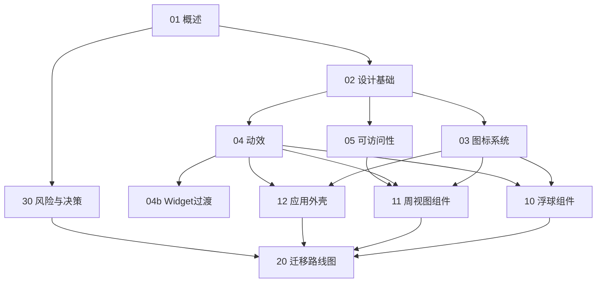

# 桌面日历 UI 优化方案

> 版本: v2.0 (模块化拆分版) | 编写日期: 2026-06-24 | 编写者: UI Designer（像素君）
> 状态: **等待评审** → 评审通过后进入 Phase A

本目录包含桌面日历应用的完整 UI 优化开发指南,按模块拆分为 10 个独立文档,便于并行开发与 PR 认领。

## 一、快速导航

### 设计基础（先读这部分）

| 文档 | 内容 | 对应 Phase |
|------|------|------------|
| [01 - 概述](./01-overview.md) | 项目背景、现状盘点、痛点 P0-P3、三档参数 | 全局背景 |
| [02 - 设计基础](./02-design-foundations.md) | shadcn/ui 选型、Geist 字体、色板 token、暗色模式、圆角间距系统 | A + C |
| [03 - 图标系统](./03-icon-system.md) | Phosphor 选型、全量 emoji→Phosphor 映射表、事件类型图标 | B |
| [04 - 动效与交互](./04-motion-and-interaction.md) | Motion 接入、微交互清单、reduced-motion 降级 | E |
| [04b - Widget 过渡动画](./04b-widget-transition.md) | 浮球 ↔ 周视图切换过渡动画,含时序/缓动/实现 | E |
| [05 - 可访问性](./05-accessibility.md) | WCAG AA 对比度、键盘快捷键、ARIA、触摸目标 | 全局贯穿 |

### 组件改造指南（按职责域分组）

| 文档 | 组件 | 对应 Phase |
|------|------|------------|
| [10 - 浮球组件](./10-components-widget.md) | BallWidget | D + E |
| [11 - 周视图组件](./11-components-week-view.md) | WeekHeader / DayHeader / EventCard / EventDialog / EventTooltip / TimeColumn / CurrentTimeLine | B + C + D + E |
| [12 - 应用外壳](./12-components-chrome.md) | StatusBar / Toast / DiagnosticPanel | B + D + F |

### 流程与参考

| 文档 | 内容 |
|------|------|
| [20 - 迁移路线图](./20-migration-roadmap.md) | Phase A-F 阶段划分、每阶段 checklist、依赖关系 |
| [30 - 风险与决策](./30-risks-and-decisions.md) | 风险权衡、决策速查表、Pre-Flight 自检 |

## 二、Phase 进度追踪表

> 每次 PR 合并后更新此表。状态图例: ⬜ 待开始 / 🟡 进行中 / ✅ 已完成 / ⚠️ 阻塞

| Phase | 主题 | 涉及文档 | 状态 | 负责人 | PR |
|-------|------|----------|------|--------|-----|
| A | 基础设施 | [02](./02-design-foundations.md) | ✅ 已完成 | - | - |
| B | 图标字体替换 | [03](./03-icon-system.md) | ✅ 已完成 | - | - |
| C | 色板与暗色模式 | [02](./02-design-foundations.md) | ✅ 已完成 | - | - |
| D | 核心组件重做 | [10](./10-components-widget.md) · [11](./11-components-week-view.md) · [12](./12-components-chrome.md) | ✅ 已完成 | - | - |
| E | 交互与动效 | [04](./04-motion-and-interaction.md) · [04b](./04b-widget-transition.md) | ⬜ 待开始 | - | - |
| F | 周边组件与打磨 | [12](./12-components-chrome.md) · [05](./05-accessibility.md) | ⬜ 待开始 | - | - |

## 三、模块依赖图

**依赖说明**:

- `02 设计基础` 是所有组件模块的前置依赖（提供 token）
- `03 图标系统` 是所有组件模块的前置依赖（提供 Phosphor 图标）
- `04 动效` 与 `05 可访问性` 依赖 `02`,且被组件模块依赖
- `20 迁移路线图` 汇总所有模块,定义执行顺序

## 四、决策速查

| 决策项 | 选择 |
|--------|------|
| 设计系统 | shadcn/ui（New York style + CSS variables） |
| 图标库 | @phosphor-icons/react（weight="regular" 统一,禁 emoji/ASCII） |
| 字体 | Geist Sans + Geist Mono（@fontsource 自托管,禁 Inter） |
| 主色 | Indigo Steel #4f6bed（弃 Tailwind 默认蓝 #3B82F6） |
| 中性色 | 浅色 Warm Slate（stone）,暗色 Cool Slate |
| 暗色模式 | class 策略 + prefers-color-scheme 跟随系统 |
| 动效库 | Motion (motion/react),MOTION_INTENSITY=4 |
| 圆角 | 8/12/16/full 四档 |
| 间距 | 4px 基线 |
| 三档参数 | DESIGN_VARIANCE=4 / MOTION_INTENSITY=4 / VISUAL_DENSITY=6 |

## 五、事件类型映射

| 类型 | 标签 | 图标 | 颜色 |
|------|------|------|------|
| interview | 面试 | `<UserFocus duotone />` | #4f6bed 钢蓝 |
| meeting | 会议 | `<Users duotone />` | #10b981 翡翠绿 |
| reminder | 提醒 | `<Bell duotone />` | #f59e0b 琥珀 |
| deadline | 截止 | `<FlagBanner duotone />` | #ef4444 警示红 |
| default | 默认 | `<Circle duotone />` | #64748b Slate |

## 六、关键约束

- 桌面应用,包体积敏感度低,可引入 Radix primitives
- Tauri WebView2/WKWebView 支持 backdrop-filter,但需 prefers-reduced-transparency fallback
- 中文字符回退 PingFang SC / Microsoft YaHei
- 全程禁 em-dash（—）,用普通连字符（-）

## 七、下一步

1. **评审本方案**:逐文档 review,确认选型与方向
2. **进入 Phase A**:shadcn init + token 配置 + 字体引入
3. **按 Phase 推进**:遵循 [20 - 迁移路线图](./20-migration-roadmap.md) 的依赖关系

## 八、历史归档

- [原 UI_OPTIMIZATION_PLAN.md](../UI_OPTIMIZATION_PLAN.md) - 单文件版方案,已拆分到本目录,仅作历史归档
